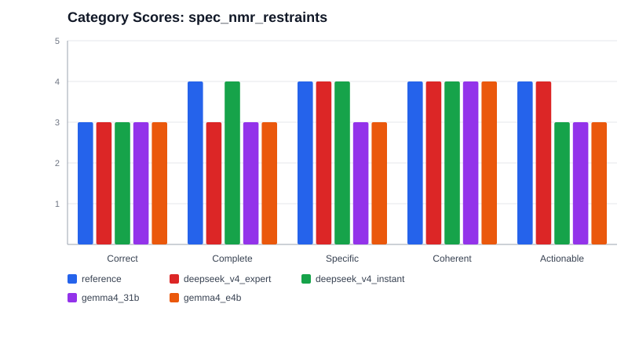
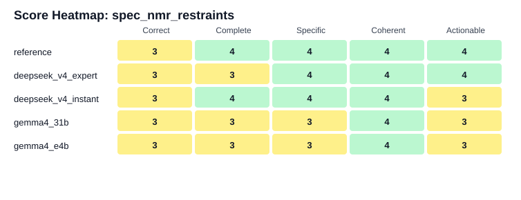

# LLM Spec Evaluation Summary

## spec_nmr_restraints

| Rank | Model | Status | Overall |
| ---: | --- | --- | ---: |
| 1 | reference | success | 3.80 |
| 2 | deepseek_v4_expert | success | 3.60 |
| 3 | deepseek_v4_instant | success | 3.60 |
| 4 | gemma4_31b | success | 3.20 |
| 5 | gemma4_e4b | success | 3.20 |

### reference

Overall score: 3.80

The candidate is a strong, well-organized intrinsic specification with clear product goals, user journey, modules, inputs, outputs, visualization requirements, and many implementation constraints. It is more actionable than most high-level specs. However, it has some technical and scientific oversimplifications around NMR-STAR restraint semantics, ambiguous restraints, atom mapping, and macromolecule/protein assumptions. It also omits several implementation-critical details such as the actual restraint retrieval endpoint, exact parser schemas, grouping logic for ambiguous restraints, threshold bins for visualization colors, and behavior for common edge cases. Since no reference specification was provided, reference alignment is null.

Strengths:
- Clearly defines the product purpose, intended users, and explicit non-goals such as avoiding validation verdicts and global confidence scores.
- Provides a comprehensive execution flow from PDB ID input through retrieval, parsing, mapping, geometry, density computation, visualization-state generation, and notebook output.
- Includes concrete input validation, runtime parameters, retry behavior, mapping coverage thresholds, failure/warning conditions, and performance targets.
- Defines useful core outputs including residue density and violation tables with fields and default violation sorting.
- Separates global, local, distance, dihedral, sequence, and table views with interaction expectations.
- Includes important scientific interpretation guidance to avoid overclaiming restraint density or violation results.
- Specifies modular implementation responsibilities, logging, diagnostics, caching, accessibility, security, and out-of-scope items.
- Provides explicit formulas for distance violations, density normalization, and general dihedral handling.

Weaknesses:
- Some domain assumptions are too simplified for real deposited NMR restraints, especially ambiguity semantics, pseudoatoms being out of scope, and exact auth-identifier mapping without external normalization.
- The external restraint data source is underspecified; the structure endpoints are provided, but no actual NMR restraint endpoint or accession resolution logic is defined.
- Parser requirements are not detailed enough to implement robust NMR-STAR support across real files.
- Several UI interactions such as hover/click synchronization may exceed what is directly available through static MolViewSpec states without additional frontend integration, but that integration is not specified.
- The visualization encoding is partly vague, with undefined color scales, violation severity bins, and density normalization display ranges.
- Failure behavior is inconsistent in places, especially for unavailable restraint files versus graceful empty states.
- The specification says it supports macromolecular structures but relies on protein-specific residue representatives and terminology.
- There are limited acceptance criteria and no explicit validation/test plan for correctness of geometry, mapping, parsing, or visualization output.

Suggested improvements:
- Add exact restraint-file retrieval mechanism and URLs/API behavior for BMRB/PDB NMR restraints, including fallback behavior when no restraint deposition exists.
- Define exact NMR-STAR fields to parse for distance restraints, dihedral restraints, bounds, restraint IDs, member/group IDs, ambiguity metadata, units, and saveframe/list identifiers.
- Clarify ambiguous-restraint data modeling: how OR groups are formed, how alternatives are counted in density, what happens when only some alternatives map, and whether smallest-distance evaluation is a deliberate approximation with warning text.
- Resolve the hard-failure versus graceful-empty-state inconsistency for missing restraint files or missing compatible categories.
- Clarify whether v1 is protein-only. If not, replace CA-based neighborhood logic with a residue representative atom strategy that supports nucleic acids and other polymers.
- Specify handling of missing CA atoms, insertion codes, negative/author residue numbering, multiple chains, waters/ligands, nonstandard residues, and multiple atom records with the same auth identifiers.
- Define the low/medium/high violation thresholds used for yellow/orange/red coloring.
- Specify whether model_index is zero-based or one-based and how coordinate models/conformers are selected in mmCIF/bcif.
- Give concrete data schemas for normalized atom tables, restraint tables, mapped restraint records, violation records, and visualization annotation files.
- Verify and pin MolViewSpec API calls and supported parse format strings, or mark them as illustrative pseudocode rather than canonical code.
- Define how thresholds affect the violation table versus visualization: whether all violations are computed and only highlighted above thresholds, or whether below-threshold violations are filtered out.
- Clarify dihedral interval parsing, especially units, wrapped intervals, inclusive boundaries, and lower-bound-greater-than-upper-bound cases.
- Define cache invalidation and config_hash contents, including dependency on thresholds, source file versions, and parser version.
- Add test cases or acceptance criteria for representative scenarios: no restraints, partial mapping, ambiguous restraints, wrapped dihedral intervals, many violations, and large structures.

### deepseek_v4_expert

Overall score: 3.60

The specification is well organized and covers the main pipeline, data structures, UI components, state model, and visualization modes. It is substantially actionable for a prototype. However, it overstates its readiness: NMR-STAR parsing is not specified at the tag/loop level, atom mapping is underspecified for common NMR cases, MolViewSpec capabilities are asserted without enough concrete schema detail, and several algorithms contain ambiguities or inconsistencies. With no reference specification provided, reference alignment is null.

Strengths:
- Clear end-to-end pipeline from PDB ID input through retrieval, mapping, geometry evaluation, violation computation, and visualization.
- Defines useful core data models for atoms, restraints, violations, residue density, and UI state.
- Includes concrete formulas for distance violations and an attempted periodic treatment for dihedral restraints.
- Provides a state-driven interaction model with explicit transitions for residue selection, violation selection, mode switching, and local/global behavior.
- UI components are reasonably well decomposed: 3D viewer, sequence view, violation table, and control bar.
- Operational assumptions and limitations are explicitly listed, including first conformer only, no ensemble averaging, and no pseudoatom handling.
- Implementation plan gives a plausible sequence of engineering tasks and names candidate Python/Jupyter tooling.

Weaknesses:
- NMR restraint parsing is described only at a high level and does not provide enough detail to implement robust parsing across real deposited restraint files.
- Atom mapping omits many common NMR complications, such as author versus label numbering, insertion codes, alternate locations, proton naming variants, pseudoatoms, ambiguous atom groups, and chain/entity mismatches.
- The dihedral calculation section contains a likely variable-name error and inconsistent handling of periodic ranges.
- MolViewSpec scene generation is described conceptually but not with concrete validated MVS node schemas, making implementation dependent on unstated API knowledge.
- Some UI behavior is vague or optional, such as drag selection mechanics, local filtering details, color scale interpolation, and faint non-violated dihedral display.
- The spec says all interactions originate outside Mol*, but does not define how external residue/table selections map to exact Mol* selection expressions.
- Fallback behavior with zero restraints is specified, but handling of partial failures and mapping quality reporting is incomplete.
- The document focuses on violated restraints for output, but also needs satisfied mapped restraints for density and overlays; this distinction is present but not always cleanly reflected in data models.

Suggested improvements:
- Specify exact NMR-STAR/mmCIF fields and loops to parse, including how restraint IDs, chain IDs, residue numbers, atom names, lower/upper bounds, and ambiguous restraints are extracted.
- Correct and fully define the dihedral angle formula, variable names, angle convention, boundary inclusivity, and full-circle/same-min-max behavior in one consistent algorithm.
- Replace the partial alias table with a complete V1 alias dictionary or explicitly define the minimal supported atom-name cases.
- Define `MappedRestraint` explicitly, including how model atom references are represented and how excluded/unmapped restraints are reported to the UI.
- Clarify multi-chain behavior consistently across retrieval, sequence view, residue keys, restraint mapping, and visualization.
- Resolve opacity scaling conflicts and provide exact color/opacity formulas for all rendered restraint categories.
- Specify concrete MolViewSpec JSON structures or examples for cartoon representations, custom lines, per-residue color mapping, selections, and camera focus.
- Add error states and user-facing messages for invalid PDB IDs, network failures, malformed files, missing atoms, no model coordinates, and partial mapping failures.
- Define sorting/filtering state for the violation table and how it interacts with residue selections and global/local modes.
- Add test cases with expected outputs for distance violation calculation, wrapping dihedral ranges, unmapped restraints, density counts, and local-neighborhood selection.

### deepseek_v4_instant

Overall score: 3.60

The specification is broad, well organized, and gives a clear product concept for visualizing NMR restraint density and violations in a notebook/Mol* workflow. It defines data models, evaluation formulas, UI components, visualization encodings, and edge cases at a useful level. However, several technical assumptions are shaky or underspecified: NMR-STAR retrieval by PDB ID is not reliable as stated, actual NMR-STAR parsing and PDB/BMRB identifier reconciliation are largely delegated away, residue identity handling is insufficient for chains/insertion codes, and the MolViewSpec integration is illustrative rather than directly implementable. There are also internal inconsistencies around missing-restraint behavior, torsion interval comparison, and lazy computation. Overall it is a strong conceptual/product spec but not yet a fully actionable engineering specification.

Strengths:
- Clearly states the user problem, target audience, scope, and guiding principles.
- Provides an end-to-end workflow from PDB input through retrieval, mapping, evaluation, and visualization.
- Defines distance and dihedral restraint data models and explicit violation magnitude calculations.
- Includes useful visualization requirements for global and local views, including clutter controls and interaction patterns.
- Separates mapping, computation, visualization state, and UI concerns in a mostly coherent architecture.
- Documents assumptions, V1 exclusions, error handling, performance considerations, and an example usage flow.

Weaknesses:
- Critical data retrieval and parsing details for NMR-STAR are underspecified and partly inaccurate.
- The atom mapping layer is declared external, but it is central to correctness and leaves major implementation risk unresolved.
- Residue and chain identity modeling is too weak for real PDB/mmCIF/NMR-STAR data.
- MolViewSpec usage is not concrete enough to be directly implemented without substantial redesign against the real API.
- Some requirements are internally inconsistent or conflict across sections.
- The first-model-only assumption is clearly stated but substantially limits validity for NMR ensembles, and the consequences are not fully reflected in UI messaging or metrics.

Suggested improvements:
- Resolve contradictory missing-data behavior: decide whether missing restraints abort analysis or produce an empty-restraint warning state.
- Replace the BMRB retrieval example with a correct PDB-to-BMRB mapping workflow or RCSB-supported restraint retrieval mechanism.
- Use full residue identifiers throughout: chain/asym ID, auth/label sequence ID, insertion code, residue type, and model ID, rather than integer residue numbers alone.
- Specify how NMR-STAR loops and fields are parsed for distance and dihedral restraints, including unit normalization, auth vs label identifiers, entity/chain mapping, and missing bounds.
- Clarify or implement support for common NMR restraint complexities, or explicitly state how unsupported ambiguous restraints, pseudoatoms, stereospecific assignments, and upper-only restraints are detected and skipped.
- Define an implementable MolViewSpec/Mol* integration strategy using actual supported schema features, including how custom lines/cylinders and residue-property coloring are supplied.
- Add acceptance criteria or tests for distance evaluation, torsion wrap-around, density counting, skipped restraints, multi-chain structures, and missing data cases.
- Fix terminology and consistency issues such as "mutant", torsion linear-vs-circular comparison, global dihedral display behavior, and lazy table computation.

### gemma4_31b

Overall score: 3.20

The candidate specification is organized and captures the broad idea of an NMR restraint support and violation viewer: fetching coordinates/restraints, mapping atoms, calculating distance/dihedral violations, computing residue-level density, and visualizing results in Mol*/MolViewSpec with sequence and table interactions. However, it remains a high-level product/technical outline rather than an implementation-ready specification. Several important technical details for real NMR-STAR/mmCIF interoperability are missing, and one core computation, dihedral range violation, is mathematically incomplete because angular periodicity is not handled. The document is coherent and readable, but engineering actionability is limited by underspecified data sources, schemas, parser behavior, error handling, edge cases, UI state definitions, and validation/testing expectations.

Strengths:
- Clear project overview with explicit objectives for support mapping, violation identification, and linked 3D/sequence/table inspection.
- Defines a straightforward end-to-end pipeline from PDB ID retrieval through parsing, atom mapping, computation, and visualization.
- Includes concrete data models for distance and dihedral restraints at a useful conceptual level.
- Provides formulas for distance calculation and distance violation magnitude.
- Explicitly states important scope constraints, including Model 1-only analysis and exclusion of pseudoatoms, ambiguous restraints, ensemble statistics, and automated scoring.
- Describes key UI components and interactions: sequence view, violation table, and 3D structure view.
- Good organization and readability, with consistent sectioning and a helpful summary table.

Weaknesses:
- Implementation details for data retrieval and parsing are too vague for reliable engineering execution.
- Real-world NMR-STAR/mmCIF atom mapping complexity is substantially under-specified.
- Dihedral violation calculation is mathematically incomplete for circular angle domains.
- No concrete schemas, APIs, file formats, or module boundaries are provided beyond conceptual objects.
- No error handling is specified for missing restraint files, unsupported restraint types, missing atoms, nomenclature mismatches, or invalid PDB IDs.
- Visualization requirements use illustrative examples but do not define exact palettes, thresholds, selection semantics, or MolViewSpec state structures.
- The support metric is a raw count and does not address normalization, double-counting, long-range vs local restraints, or separate distance/dihedral contributions.
- No testing, validation, acceptance criteria, or reproducibility artifacts are defined beyond the general claim of using MolViewSpec.

Suggested improvements:
- Specify exact data sources and retrieval endpoints for mmCIF and NMR-STAR/restraint files, including how PDB IDs are mapped to BMRB or PDB restraint records.
- Define the NMR-STAR categories/saveframes and fields to parse for distance and dihedral restraints, rather than referring generically to atom indices.
- Expand atom mapping to handle mmCIF author vs label identifiers, chain/entity IDs, residue numbering differences, insertion codes, alternate locations, atom name synonyms, missing atoms, and model selection.
- Define behavior for unsupported restraints, especially ambiguous restraints, pseudoatoms, missing coordinates, multiple assignments, and nonstandard residues: skip, warn, fail, or report separately.
- Correct dihedral violation computation to account for periodic angular distance and ranges that wrap around the -180/180 or 0/360 boundary.
- Clarify whether restraint ranges are always min/max or whether single-bound upper/lower restraints are supported, and define default handling for missing bounds.
- Specify thresholds or configurable parameters for weak/strong violations and color mapping rather than using examples only.
- Define concrete output artifacts and interfaces, such as JSON schemas for parsed restraints, violations, residue density, and MolViewSpec state generation.
- Describe MolViewSpec representation details sufficiently for implementation: components, selections, color themes, line/cylinder primitives, camera transitions, and table-to-view state updates.
- Add validation, testing, and acceptance criteria using known PDB/NMR-STAR examples and expected computed violations.
- Include performance expectations or limits for large structures/restraint sets, plus caching and failure-handling behavior for network retrieval.
- Clarify how residue density is normalized, if at all, and whether raw counts should be separated by restraint type or sequence length/context.

### gemma4_e4b

Overall score: 3.20

The specification is well organized and provides a plausible high-level product concept with data models, violation calculations, and UI behaviors. However, it is not yet implementation-ready for a real NMR restraint viewer. The largest gaps are in data retrieval and mapping from PDB/mmCIF plus NMR-STAR restraints to actual atoms, which is one of the hardest parts of the project but is only described as a component responsibility. Several biological and file-format realities are omitted, including insertion codes, alternate locations, model IDs, author versus label residue numbering, atom naming differences, BMRB/PDB cross-references, missing restraints, and parse failures. The dihedral violation logic acknowledges cyclic angles but then gives a non-cyclic interval comparison that is incorrect for wraparound ranges such as 170° to -170°. The UI requirements are generally understandable, but some are vague or optional, and the reporting use case is not specified. Overall, it is a coherent draft with useful structure, but it needs more precise parsing, mapping, edge-case, acceptance, and output requirements before engineering implementation.

Strengths:
- Clear product goal: interactive spatial analysis of NMR restraints relative to a deposited structure.
- Good separation into pipeline components: retrieval, annotation/mapping, evaluation, and visualization.
- Defines core entities for atoms, distance restraints, dihedral restraints, violations, and support density.
- Provides explicit formulas for distance violation magnitude and a basic support-density metric.
- Includes important V1 scope limits such as first-conformer-only analysis and exclusion of ensemble statistics.
- Specifies several concrete UI components: 3D view, sequence view, local view, and violation table.
- State-driven UI requirement is useful and helps avoid unnecessary recomputation during interaction.

Weaknesses:
- Data retrieval is underspecified despite being central to the product.
- Atom and residue identifiers are oversimplified for real PDB/mmCIF and NMR-STAR data.
- The dihedral violation formula is technically incomplete or incorrect for cyclic angle intervals.
- The specification excludes ambiguous restraints and pseudo-atoms, which are common in NMR data, without defining how such records are detected, skipped, or reported.
- No concrete reporting requirements are provided even though reporting is a stated success criterion.
- The density metric is simplistic and does not define how restraints involving multiple residues are counted or normalized.
- No error handling, validation, logging, or unsupported-data behavior is specified.
- UI requirements use vague terms such as high density, near-instantaneous, low clutter, and neighboring residues without fixed thresholds or acceptance criteria.
- The data model lacks unique IDs, provenance, file references, and status fields needed for traceability and debugging.
- The specification does not define persistence, export, API contracts, frontend/backend boundaries, or deployment assumptions.

Suggested improvements:
- Define exact data sources and retrieval behavior, including how a PDB ID maps to NMR-STAR/BMRB restraint files and what happens when no restraint data is available.
- Expand the atom identity model to include model number, auth and label chain/residue IDs, insertion code, alternate location, atom serial or stable atom key, entity/asym IDs, and support for non-single-character chain IDs.
- Specify the restraint parser and mapping rules in detail, including atom-name normalization, residue-number mapping, missing atoms, ambiguous restraints, pseudo-atoms, and unsupported restraint types.
- Correct the dihedral interval and violation-magnitude algorithm to handle circular ranges and shortest angular distance properly.
- Add unique identifiers and provenance fields for atoms, restraints, violations, source files, and parsing status.
- Clarify whether non-violating restraints are represented separately from violations, since the Local View needs to render supported restraints as well as violating ones but the table only lists violations.
- Specify output/reporting requirements: report format, required sections, included metrics, export options, and reproducibility metadata.
- Resolve the distance-versus-dihedral rendering conflict by defining whether they can be shown together, separately, or through explicit user modes.
- Replace optional or future UI language with clear V1 requirements or move those items to a non-requirements roadmap section.
- Define error handling, validation, and user-facing messages for invalid PDB IDs, missing files, malformed restraints, unmapped atoms, unsupported restraints, and empty results.
- Add acceptance criteria or test cases for distance calculation, dihedral calculation, wraparound dihedral violations, density counting, residue selection, and table-to-structure highlighting.
- Define thresholds, scales, and legends for density coloring, violation magnitude coloring, opacity, and violation burden indicators.
