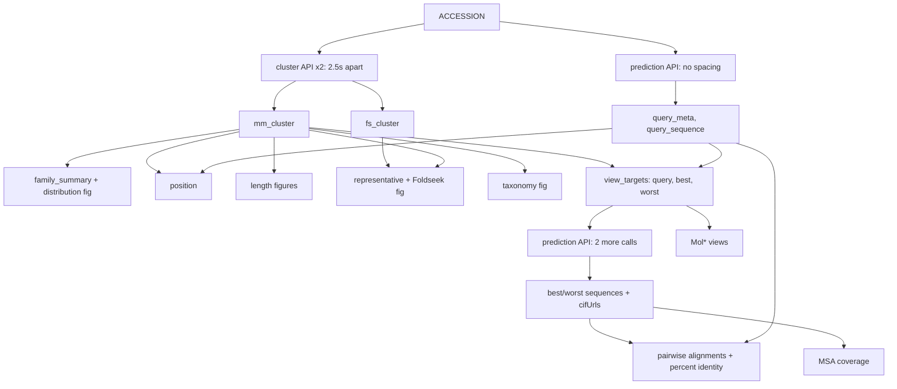

# Notebook Design

Target: `notebooks/cluster_quality_diagnostic.ipynb`
Shared module: `src/insightfold/cluster_quality_utils.py` (see DD-1)

## Section Outline

| Section | Purpose | Inputs | Outputs | Requirements | Optional? |
|---|---|---|---|---|---|
| S0 Bootstrap | Clone repo, extend `sys.path`, install non-preinstalled packages | none | importable module | NFR-001, NFR-007 | mandatory |
| S1 Parameters | The single user input | user edit | `ACCESSION` | REQ-001 | mandatory |
| S2 Identify | Confirm the protein before any slow call | `ACCESSION` | `query_meta`, `query_sequence` | REQ-001 | mandatory |
| S3 Orientation | Explain both clusterings and the InterPro framing | none | markdown only | REQ-E1 | mandatory |
| S4 Fetch | Retrieve both clusterings, spaced; refusal gates | `ACCESSION` | `mm_cluster`, `fs_cluster` | REQ-002, REQ-014, NFR-003 | mandatory |
| S5 Family distribution | **The headline.** Summary statistics and the distribution figure | `mm_cluster` | `family_summary`, fig | REQ-003 | mandatory |
| S6 Query position | Where the user's protein sits, categorically | `mm_cluster`, `query_meta` | `position`, fig | REQ-004, REQ-E2 | mandatory |
| S7 Length structure | Length histograms and length against pLDDT | `mm_cluster`, `fs_cluster` | 2 figs | REQ-007 | optional |
| S8 Structural superfamily | What a Foldseek point is, then the distribution. No query marker | `fs_cluster`, `mm_cluster` | `representative`, fig | REQ-005, REQ-006, REQ-E3 | **optional**: skipped with a named message when the Foldseek cluster is unusable and the sequence cluster is fine (REQ-014a) |
| S10 Extremes | Identify best and worst; apply the collapse rule | `mm_cluster`, `query_meta` | `view_targets` | REQ-009, REQ-010 | mandatory |
| S11 3D views | Query, best, worst in Mol\*, plus per-residue pLDDT profiles | `view_targets` | 2 or 3 viewers, 2 or 3 profile figs | REQ-010, REQ-010a, REQ-V6, REQ-V8 | **profiles mandatory, viewers optional** |
| S12 Alignments | Local pairwise. Identity, aligned length and coverage as text, plus the rendered figure | `view_targets`, sequences | numbers, 1 or 2 figs | REQ-011, REQ-011a, REQ-E4 | **numbers mandatory, figure optional** |
| S13 MSA coverage | Depth evidence where available | `msaUrl` or user file | 0 to 3 figs | REQ-012, REQ-013 | optional |
| S14 Summary | Restate family level, position, caveats | all | markdown | REQ-016 | mandatory |

Optional sections print a named explanation and continue. Mandatory sections raise with a named
reason. The reader must never be unsure whether a missing figure means "unavailable" or "broken".

## Module Layout

`src/insightfold/cluster_quality_utils.py` is one flat module, named by domain so other
notebooks can share it, with an **orchestration layer** at the end holding one function per
notebook cell.

| Layer | Contents |
|---|---|
| Constants | API bases, rate policy, pLDDT bands and palettes, SSE track colours, TM-score interpretation points |
| Errors | `ClusterQualityError` and its subclasses, one per refusal gate |
| Dataclasses | `QueryMeta`, `ClusterMembers`, `FamilySummary`, `Position`, `ViewTarget`, `AlignmentResult`, `StructureSource`, `ColourRun`, `Superposition`, `ClusterPair`, `ModelSelection` |
| API access | `fetch_prediction`, `fetch_cluster`, `_get` with the retry and rate policy, `load_pinned_cluster` |
| Parsing | `parse_plddt_from_cif`, `ca_coordinates`, `parse_secondary_structure`, `fetch_verified_structure` |
| Statistics | `summarise_family`, `locate_query`, `identify_view_targets`, `align_pair`, `superpose` |
| Plotting | one `plot_*` per figure, each returning a bare `Figure` |
| Mol\* views | one builder per view, plus `show_mol_view`, `show_model_panel` |
| **Orchestration** | one `report_*` or `show_*` per cell, listed below |
| Bootstrap | `prepare_environment()`, the hook `insightfold.notebook_setup.setup()` calls after it imports this module |

**Why the orchestration layer exists.** A notebook cell is a reading surface. Formatting loops,
try/except ladders and download bookkeeping are implementation, and a reader scrolling for the
science should not have to scroll past them. Every cell below the bootstrap is now a single
call, and the logic it used to hold is a named, testable function.

**`report_*` prints, `show_*` renders.** The split is load-bearing, not cosmetic: the reports
are mandatory output and must never sit inside a figure's try/except (REQ-011a), so a missing
pyMSAviz costs the reader a picture and never a number.

| Cell call | Replaces | Returns |
|---|---|---|
| `ensure_optional_packages()` | the install cell | none |
| `resolve_accession()` | normalise plus the interpretation print | `str` |
| `report_query()` | the identity card | `QueryMeta` |
| `load_clusters()` | both fetches, the size report **and** both refusal gates | `ClusterPair` |
| `report_family_summary()` | the summary table | `FamilySummary` |
| `report_query_position()` | the descriptor and percentile | `Position` |
| `show_family_distribution()`, `show_structure_cluster()`, `show_length_vs_plddt()` | the three distribution figures | none |
| `select_models()` | the collapse rule, the per-model fetches and the report | `ModelSelection` |
| `show_model_panels()`, `show_plddt_profiles()` | the Mol\*-plus-PAE panels and the profiles | none |
| `report_alignments()` / `show_alignments()` | the mandatory numbers / the optional figures | `dict[str, AlignmentResult]` / none |
| `report_superpositions()` / `show_superposition_blocks()` | TM-align plus its per-model blocks | `dict[str, Superposition]` / none |
| `report_msa_status()`, `report_summary()` | the MSA status line and the closing summary | none |

**`ClusterPair` and `ModelSelection` carry state between cells** so the notebook keeps named
variables rather than a session object: the data flow stays visible in the cells, while the
bookkeeping does not. `ModelSelection` additionally **caches each model's verified mmCIF
download**, which is why it is an object and not a tuple: the 3D views, the pLDDT profiles and
the superposition all need the same file, and it is large, served without a length header and
unresumable.

**What stays visible in the notebook, deliberately:** the bootstrap cell, the `ACCESSION`
field and the display-preferences field. Those are the interface; everything else is
implementation.

**The bootstrap cell is irreducible, not unrefactored.** It is the one cell that cannot call
this module, because its job is to make the module importable, so the checkout search is written
out longhand there and nowhere else. Everything that can run after the import moved to
`insightfold/notebook_setup.py`, shared with `homodimer_diagnostic.ipynb`: selecting the inline
backend, importing the analysis module, and calling this module's `prepare_environment()` to
install optional packages, apply the style and print the banner. The cell is a Colab form
(`display-mode: "form"`), so on Colab it collapses to a title bar and the code is out of sight.
That absorbed the separate `%matplotlib inline` cell, which is why the notebook lost a cell.

## Data Flow

The critical path is two cluster calls plus three prediction calls. Everything else is local
computation over arrays already in memory.

## Variable And Artifact Handoff

| Variable | Produced in | Consumed by | Type |
|---|---|---|---|
| `ACCESSION` | S1 | S2, S4 | `str`, bare UniProt accession |
| `query_meta` | S2 | S6, S8, S10, S14 | dataclass: accession, description, organism, length, pLDDT, `latestVersion` |
| `query_sequence` | S2 | S12 | `str` |
| `mm_cluster` | S4 | S5 to S10 | `ClusterMembers` dataclass wrapping a DataFrame |
| `fs_cluster` | S4 | S7, S8 | `ClusterMembers` |
| `family_summary` | S5 | S14 | dataclass: mean, median, sd, band fractions, p25-p75 width |
| `position` | S6 | S14 | dataclass: percentile, category, band width, whether the query was present |
| `representative` | S8 | S14 | accession plus whether the query was in the Foldseek cluster |
| `view_targets` | S10 | S11, S12, S13 | list of 2 or 3 records: role (query/best/worst), accession, pLDDT |

**Rule:** no section reads a variable it did not receive through this table, and no section mutates
another section's output.

## Dependency Policy

**NFR-007 in `requirements.md` is the canonical list.** Reproduced here only so a stale copy is
recognisable as stale.

Allowed: `numpy`, `pandas`, `matplotlib`, `seaborn`, `requests`, `molviewspec`, `biopython`,
`pymsaviz`.

Prohibited: `torch`, `gemmi`, `plotly`, `scipy`, `ptitprince`, `google-cloud-bigquery`, `networkx`.
The prohibition covers pyMSAviz's **resolved transitive tree**, which must be checked rather than
assumed.

This notebook sets its own policy. The repo's `pandas` prohibition is explicitly per-consumer and
binds `complex_interface_utils.py` and the dimer notebooks, not this one.

**Install cell (S0).** Follows D9: `git clone --depth 1` plus `sys.path.insert(0, root / 'src')`.
**Never `pip install` the package itself**, which would resolve `pyproject.toml` and drag in the
heavy dependency set. Third-party libraries are pip-installed individually, as the dimer notebook
already does for `molviewspec`.

Colab preinstalls numpy, pandas, matplotlib, seaborn and requests, so the install cell covers
`molviewspec`, `biopython` and `pymsaviz` only, measured at roughly 6 s. `molviewspec` and
`pymsaviz` are imported **lazily** inside the functions that need them, so an install failure
degrades the optional sections without breaking the mandatory ones.

> **TODO(merge):** the bootstrap cell will pin a feature branch until this work merges. Flip it to
> `main` or a release tag before release, and grep for `TODO(merge)`.

## Parser, API And Algorithm Choices

| Choice | Decision | Rationale |
|---|---|---|
| Cluster retrieval | `requests`, 2.5 s apart | 0.8 s spacing measured to produce spurious 5xx; 2.5 s measured clean |
| Query and extreme sequences | Prediction endpoint, **no spacing** | 45 back-to-back requests, zero failures, 0.15 s median latency. Only three calls needed |
| PAE retrieval and parsing | `paeDocUrl` from the prediction endpoint, parsed with `complex_interface_utils.parse_pae` | Per D8 this is that function's **second consumer**, so it is reused rather than reimplemented. Monomer documents omit the `chains` array, so the sequence length is passed as `fallback_lengths` |
| Raincloud | matplotlib violin clipped to its upper half, jittered scatter, boxplot | Recreates the source notebook's figure without ptitprince. Points subsample above 2,000: a 93,793-member cluster otherwise draws as a solid block and takes longer than the API call that produced it |
| Pairwise alignment | Biopython `PairwiseAligner(mode='local')`, BLOSUM62, affine gaps −11/−1 | **Local, not global.** Global identity over full alignment length penalises length and domain-architecture mismatch, which is exactly the case this notebook exists to surface. Nothing bounds query-to-member length ratio, since AFDB50's overlap criterion holds against the representative rather than between members. BLOSUM62 with −11/−1 is the BLASTP local default, so local use also fixes a parameter-provenance mismatch |
| Identity reporting | "X% identity over N aligned columns, covering Y% of the query"; definition stated in the notebook | Identity alone is not interpretable without the aligned block size. A high identity over 40 columns of a 400-residue protein means something very different from the same identity over 380 |
| Distribution statistics | numpy only, no scipy | Mean, median, percentile and band counts need nothing more |
| Raincloud figure | seaborn split-violin plus jittered strip plus boxplot | Replaces ptitprince, which is an extra dependency for one figure |
| Taxonomic composition | Horizontal stacked bar, matplotlib | A Sankey shows flow between levels; this is composition split by one ordinal variable. Plotly's Sankey is a JS widget, excluded by NFR-006 |
| Taxonomic lineage | UniProt taxonomy REST, `rank:genus`, **batch size 20** | 53 of 60 genera covering 75.4% of members in 1.82 s. Batch size 30 silently drops hits. Species level is infeasible and unsafe |
| Alignment rendering | pyMSAviz | Accepts an in-memory alignment, returns a bare `Figure`, takes a custom colour dict directly |
| MSA coverage | ColabFold `plot_msa_v2` reimplemented in matplotlib | No ColabFold dependency; a3m lowercase insertions stripped first |
| 3D views | MolViewSpec via `$molviewspec-rendering` | Repo standard. No alternative 3D viewer library |

## Visualization Plan And Fallback Behaviour

> Heading spelled to match `check_spec_pack.py`'s required marker, which the scaffold template sets.
> Prose elsewhere follows the repo's British-spelling convention.

| Figure | Section | Fallback |
|---|---|---|
| Sequence-cluster raincloud with the user's protein marked (REQ-V1) | S6 | none; mandatory |
| Foldseek distribution, representative marked (REQ-V2) | S8 | none; mandatory |
| Length histograms (REQ-V3) | S7 | named skip message |
| Length-versus-pLDDT joint plot (REQ-V4) | S7 | named skip message |
| Taxonomic stacked bar (REQ-V5) | S9 | If the taxonomy lookup fails, print a named message and skip |
| Mol\* views (REQ-V6) | S11 | `try/except ImportError` and a printed explanation |
| Pairwise alignments (REQ-V7) | S12 | If pyMSAviz is unavailable, print percent identity as text. Percent identity must survive even when the figure does not |
| MSA coverage (REQ-V8) | S13 | On 403, a named message |

**Viewer budget.** Browsers cap concurrent WebGL contexts at 16 and silently blank the oldest past
the cap. This notebook uses at most 3.

**Colour.** Reuse one pLDDT band palette across every figure that bins by band, so the stacked bar,
the raincloud and the 3D views agree. Drop non-finite values before colouring; a colormap paints
"bad" values opaque black, the most emphatic colour in the scene, on exactly the residues with no
measurement.

## Provenance And Reproducibility Plan

- Print the AFDB `latestVersion` for the user's protein, plus the run date and time, in S2.
- Print `clusterTotal` alongside the returned array length for both clusterings, so any future
  disagreement (OQ-3) is visible in the output rather than silent.
- State the percent-identity definition in the notebook, not only in this spec.
- Record which endpoint each number came from, since the cluster and prediction endpoints round
  `averagePlddt` and `globalMetricValue` slightly differently.

## Design Decisions

**DD-1. A shared module, not notebook-resident code.** Logic lives in
`src/insightfold/cluster_quality_utils.py`; the notebook orchestrates. This mirrors
`homodimer_diagnostic` and is what makes a pinned-fixture test harness possible at all, since a test
cannot import a notebook cell. Named by domain per D8. It does not import
`complex_interface_utils.py` and shares nothing with it yet; per D8 a function is promoted to a
shared module when its second consumer appears, not in advance.

**DD-2. Two parameter cells.** The accession sits alone at the top so the entry point is one line.
Display preferences sit later, before the sections they affect.

**DD-3. Descriptive, not prescriptive.** The notebook shows the distribution and its extremes. It
does not rank candidates or recommend a substitute. A ranked recommendation was specified and then
cut, because AFDB clusters can contain functionally divergent proteins near the top of the pLDDT
distribution and no reliable screen for that exists without family-level annotation, which is itself
deferred. Cutting it is what allows S10 to S12 to stay simple and honest.

**DD-4. REVISED. S12 reports distance, and distance alone does not decide relatedness.** Identity
cannot separate the cases on its own. Measured by local alignment: 26.73% (`Q13148`, functionally
divergent), 25.09% (`Q9I1F6`, legitimate LacI-family relatives) and 33.68% (`P0AA25`, genuine
thioredoxins). The divergent case scores **higher** than the legitimate one. The notebook
therefore reports identity **with aligned length and query coverage**, beside the member's
description and species, and tells the reader to read them together. It does not claim that a low
number means a different protein.

The honest framing throughout is **distant homologue with possibly different biological function**,
not "a different protein": TDP-43 and Prp24p are both RRM-domain proteins, so Prp24p is a genuine
remote homologue. This weakens the original justification for cutting the candidate table, but the
cut stands for the other reason, that nothing available reliably separates useful from useless
substitutes.

**DD-4a. NEW. Average pLDDT is disorder-weighted, so the per-residue profile is mandatory.** A chain
average is substantially a function of intrinsic disorder fraction rather than prediction quality.
`Q13148` is the case in point: TDP-43's long prion-like C-terminal IDR plausibly explains both the
62.4 cluster mean and the promiscuous clustering, since low-complexity regions cluster readily. The
per-residue profile for each rendered model (REQ-010a) costs nothing, because the mmCIF is already
downloaded, and it is what stops a reader concluding "low mean, therefore badly predicted".

**DD-5. The notebook always calls the live API.** No fixture mode, no `TESTING` branch. Pinned
responses drive an external harness against the module's functions.

**DD-6. REVISED. Fail-soft applies to renderings, not to numbers.** A Must requirement may not live
inside a section that can silently vanish.

| Always raises on failure | Degrades with a named message |
|---|---|
| S0 to S6, S10, S14 | S7 length figures |
| Per-residue pLDDT profiles (REQ-010a) | S8 Foldseek section, when its cluster is unusable and the sequence cluster is fine |
| Identity, aligned length and coverage as text (REQ-011a) | S9 taxonomy |
| | S11 Mol\* viewers |
| | S12 rendered alignment figure |
| | S13 MSA coverage |

The distinction matters because C025 tells the reader that identity and coverage are how they check
relatedness. If those numbers could soft-fail, the caveat would promise something nothing delivers.

**DD-7. NEW. Degrade per clustering, not per run.** The sequence-cluster analysis is the notebook's
headline and must survive a problem with the structure cluster. `P00533` has a Foldseek
`clusterTotal` of 1 and a perfectly usable MMseqs2 cluster; refusing the whole run there would
discard the entire analysis over an optional section.
